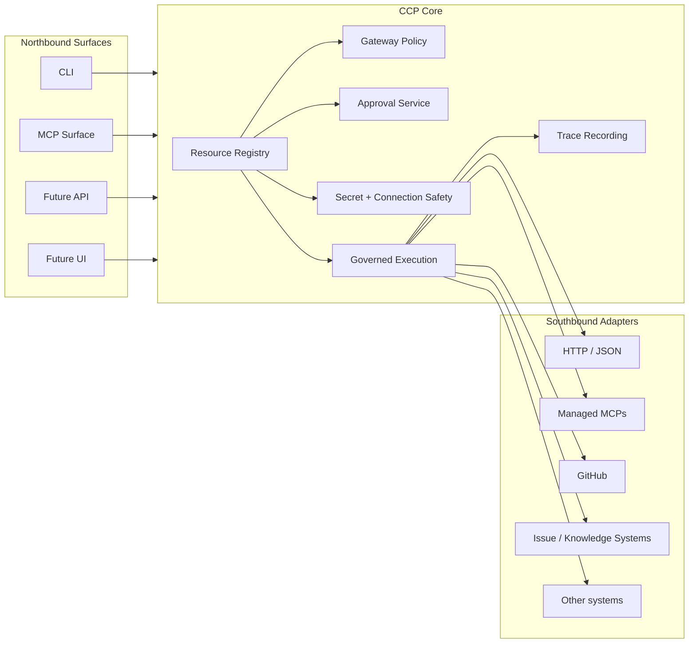
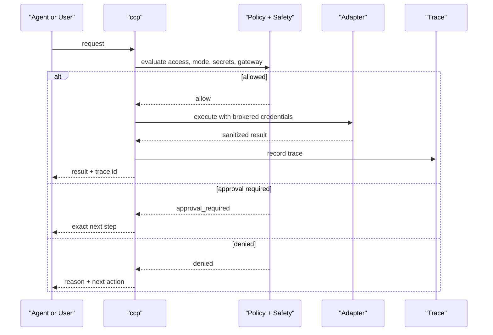

# Context Control Plane

**Context Control Plane**, or **CCP**, is an open-source vendor-neutral control-plane kernel for **AI agents**, **MCP integrations**, and **governed tool execution**.

It gives humans and agents one small, stable layer for:

- policy and approval checks
- safe secret and connection handling
- traceable execution
- machine-readable CLI contracts

If you want AI to call tools without turning your laptop into a confidence-powered compliance incident, this is the lane.

## What CCP Solves

Modern AI tooling usually has the same problems:

| Problem | What usually happens | What CCP does |
| --- | --- | --- |
| Tool access is inconsistent | every agent or script invents its own rules | one control surface for policy, approval, and execution |
| Secrets leak too easily | tokens end up in env vars, logs, or chat | brokered secret handling and redaction-first output |
| MCP integrations are hard to trust | a plugin can read, write, or phone home quietly | trust tier, sandbox posture, egress policy, and safe test reporting |
| Approvals become a maze | multiple gates, unclear ownership, bad UX | one user-facing approval model |
| Auditing is weak | logs are scattered and hard to explain | trace records with a compact execution timeline |

## What CCP Is

CCP is a **kernel**, not a full product bundle.

That means it focuses on a small core:

- **northbound surfaces** like CLI and future MCP/API interfaces
- **governance** like gateway policy and approvals
- **connection execution** with safe secret handling
- **traceability** for governed actions
- **resource loading** for configuration and policy

It does **not** require:

- a mandatory UI
- mandatory Vault
- mandatory shell shims
- company-specific context trees
- one vendor's agent stack

## Architecture At A Glance



## How A Request Flows



## Current Capabilities

The packaged `ccp` CLI is intentionally compact and machine-readable.

| Area | Commands |
| --- | --- |
| Discovery | `ccp capabilities`, `ccp resource kinds`, `ccp resource list`, `ccp resource get`, `ccp schema get`, `ccp version` |
| Packs and validation | `ccp pack status`, `ccp validate`, `ccp doctor`, `ccp upgrade plan` |
| Secrets | `ccp secret status`, `ccp secret explain`, `ccp secret set`, `ccp secret inspect`, `ccp secret delete` |
| MCP governance | `ccp mcp list`, `ccp mcp test`, `ccp mcp add`, `ccp mcp disable` |
| Gateway and policy | `ccp gateway status`, `ccp gateway explain` |
| Connection safety | `ccp connection explain`, `ccp approval issue`, `ccp approval inspect` |
| Execution and traces | `ccp exec plan`, `ccp exec run`, `ccp trace list`, `ccp trace get`, `ccp trace explain` |

All important commands support `--json`.

## Quick Start

### 1. Install locally

```bash
python3.11 -m pip install --upgrade pip
python3.11 -m pip install -e .
ccp version --json
```

### 2. Explore what the core supports

```bash
ccp capabilities --json
ccp resource kinds --json
ccp schema get ConnectionProfile --json
```

### 3. Inspect policy and execution posture

```bash
ccp gateway status --json
ccp mcp list --json
ccp secret status --json
```

### 4. Understand a governed action before running it

```bash
tmp_dir="$(mktemp -d)"
cat > "$tmp_dir/demo-connection.json" <<'JSON'
{
  "apiVersion": "ccp.io/v1beta1",
  "kind": "ConnectionProfile",
  "metadata": {
    "name": "demo-connection"
  },
  "spec": {
    "adapter": "mock",
    "endpoint": "https://api.example.test",
    "classification": "internal",
    "allowedAccess": ["read"],
    "allowedModes": ["connect"],
    "defaultMode": "connect"
  }
}
JSON

ccp connection explain \
  --resource-dir "$tmp_dir" \
  --name demo-connection \
  --access read \
  --mode connect \
  --operation "read external data" \
  --json

rm -rf "$tmp_dir"
```

Approval note: `ccp approval issue` requires an explicitly configured signer via `CCP_APPROVAL_SIGNING_KEY`, `CCP_APPROVAL_SIGNING_KEY_FILE`, or `CCP_APPROVAL_SIGNING_KEY_PATH`. CCP does not auto-create approval signers.

### 5. Inspect traces after execution

```bash
ccp trace list --json
ccp trace explain --id TRACE_ID --json
```

## Core Concepts

| Concept | Meaning |
| --- | --- |
| `ConnectionProfile` | a governed outbound connection definition |
| `SecretBackend` | where secret references are resolved safely |
| `GatewayPolicy` | allow, deny, or approval-required decision rules |
| `McpServer` | a managed MCP definition |
| `McpPolicy` | MCP trust, sandbox, egress, sanitization, and tool rules |
| `ApprovalReceipt` | one exact approval for one governed action |
| `TraceRecord` | sanitized execution trace |

## Project Layout

| Path | Role |
| --- | --- |
| `sdk/python/context_control_plane/kernel/` | contracts, registry, policy, approvals, execution, tracing |
| `sdk/python/context_control_plane/adapters/` | southbound adapter interfaces and implementations |
| `sdk/python/context_control_plane/surfaces/` | northbound surfaces such as the CLI |
| `tests/` | focused contract and behavior tests |

## Design Principles

CCP is built around three product principles:

| Principle | What it means in practice |
| --- | --- |
| **Simpler than expected** | one approval story, one resource model, compact commands |
| **Safer than expected** | brokered secrets, redaction-first output, traceability, MCP trust posture |
| **Easier to integrate than expected** | stable CLI contracts, resource-driven config, vendor-neutral core |

## What CCP Is Not

CCP is **not**:

- a mandatory IDE plugin
- a mandatory UI
- a monolithic workflow product
- a replacement for your secret manager
- a requirement to rewrite your whole tool stack on day one

It is meant to be the **small, reusable middle layer** between users or agents and real systems.

## Current Status

This project is usable, but still early.

| Area | Status |
| --- | --- |
| Resource model and CLI contract | strong |
| Governed execution and traces | strong |
| Secret-safe execution | strong |
| MCP trust and safe test posture | strong on macOS; observational elsewhere |
| Full MCP invocation through core | still evolving |
| Zero-config onboarding | improving, with inline examples for now |

That is deliberate. The kernel is being built to be trustworthy first and flashy second. The second one gets more tweets, but the first one survives contact with reality.

## Why The Name Matters

The project is called **Context Control Plane** because the goal is not just configuration. The goal is to control:

- what context is in scope
- what actions are allowed
- what secrets can be used
- what traces are kept
- what agents and tools can safely do

In other words: context without control becomes drift, and control without context becomes bureaucracy. CCP tries to avoid both, which is one of those rare moments in software where we aim for fewer fires instead of more dashboards.

## Contributing

The public core should stay:

- generic
- vendor-neutral
- easy to reason about
- strict about security boundaries

If a change feels product-specific, tenant-specific, or workflow-heavy, it probably belongs in a downstream pack or integration layer instead of the kernel.

## License

This project is licensed under **Apache License 2.0**. See `LICENSE`.
