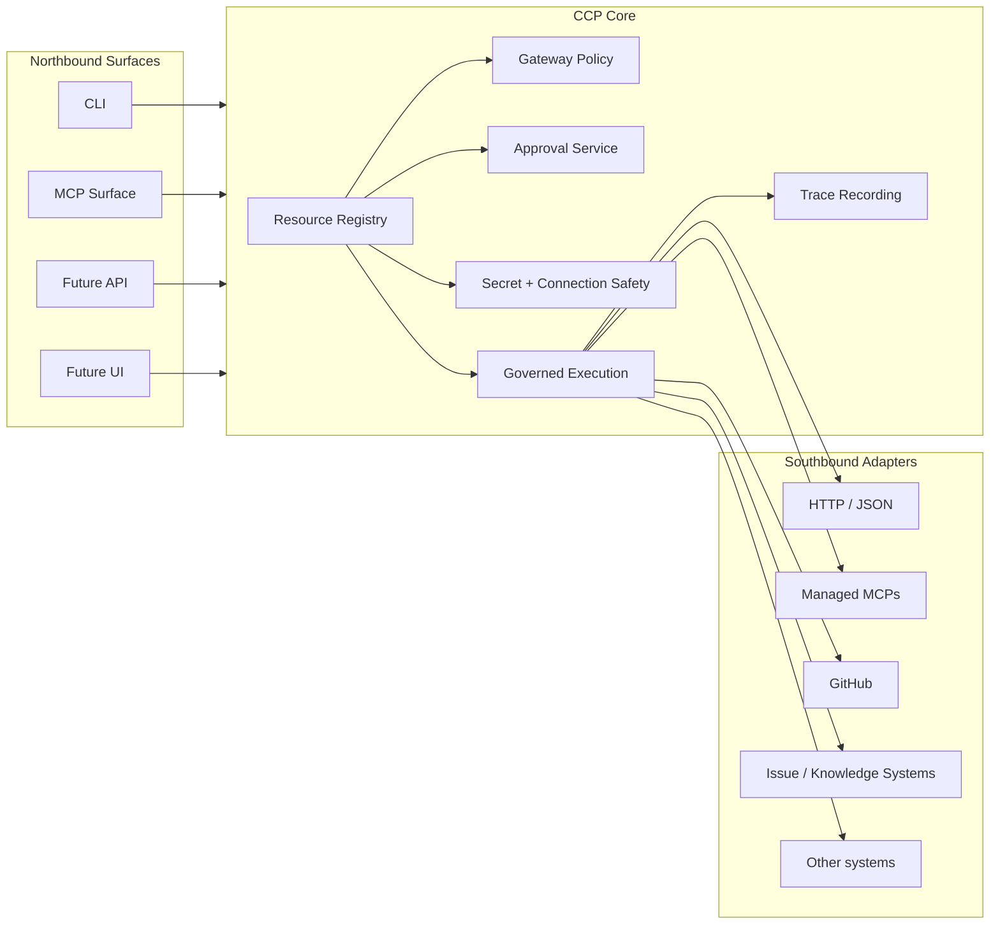
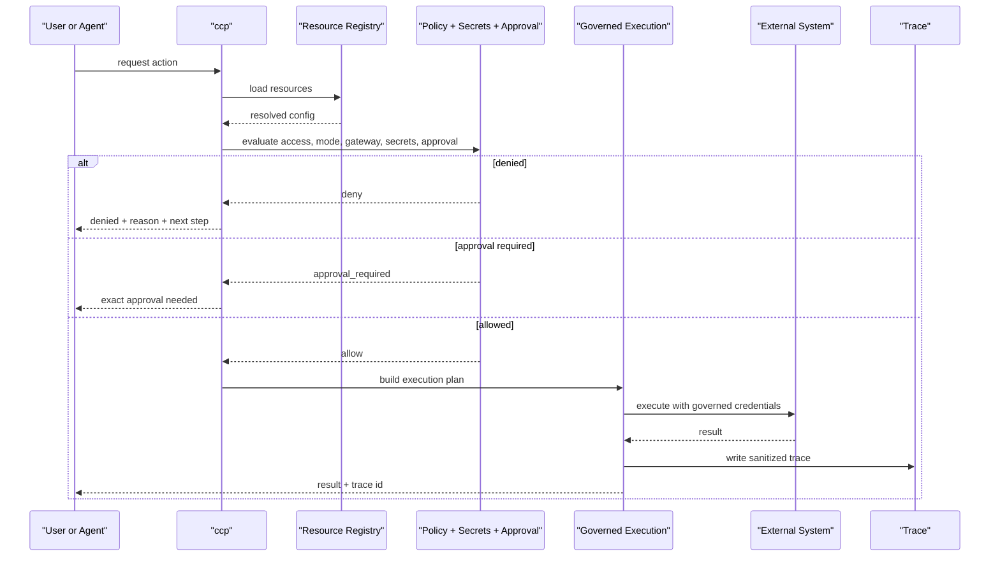
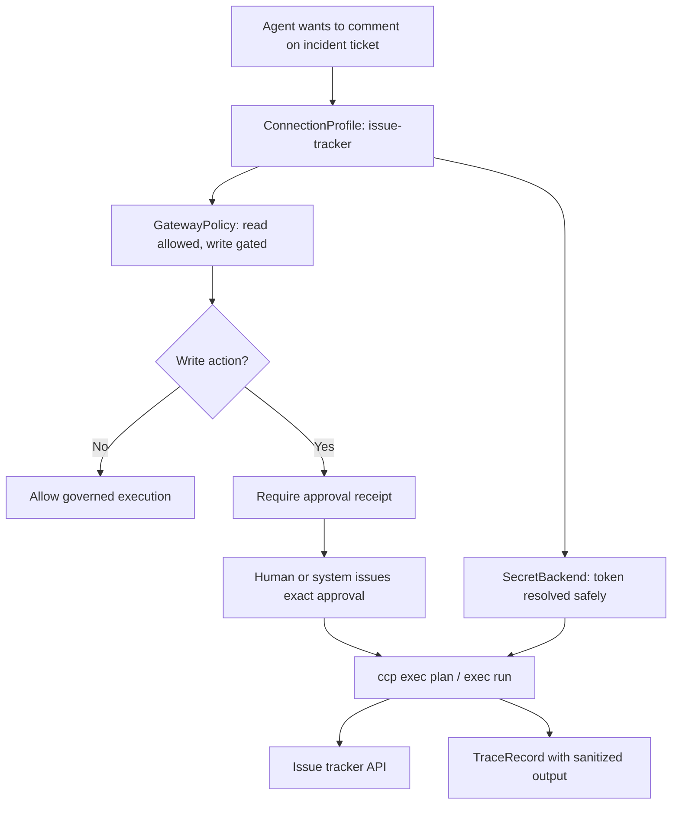

# Context Control Plane

**Context Control Plane (CCP)** is an open-source control-plane kernel for AI agents, MCP integrations, governed execution, secure secret handling, and traceable tool access.

It gives teams one small, reusable layer between **an agent that wants to act** and **a real system that should not be touched blindly**.

If you want AI to call tools without turning policy, secrets, approvals, and auditability into a side quest, this is the layer.

## Why CCP Exists

Modern AI tool stacks tend to break in familiar ways:

- access rules live in prompts, wrappers, or tribal knowledge
- secrets leak into env vars, logs, stdout, or chat
- MCP integrations are adopted faster than they are evaluated
- approvals become inconsistent or hard to audit
- after an agent acts, nobody can clearly explain what happened

CCP exists to make those concerns **explicit, inspectable, and reusable**.

## What CCP Provides

| Capability | What CCP does |
| --- | --- |
| Governed execution | evaluates access, mode, gateway policy, approvals, and secret posture before execution |
| Secret-safe connections | resolves secret references through managed backends instead of pushing raw values into prompts or logs |
| Approval receipts | binds one approval to one exact governed action |
| MCP trust posture | models MCP servers, trust tier, sandbox posture, egress policy, and safe test reporting |
| Traceability | records compact execution traces with sanitized output |
| Machine-readable CLI | exposes deterministic JSON-first surfaces for scripts, wrappers, and future UIs |

## What CCP Is

CCP is a **kernel**, not a full product bundle.

That means it focuses on a small reusable core:

- northbound surfaces like CLI and future MCP/API interfaces
- governance like gateway policy and approvals
- connection execution with safe secret handling
- traceability for governed actions
- resource loading for configuration and policy

It does **not** require:

- a mandatory UI
- a mandatory Vault deployment
- company-specific context trees
- one vendor's agent stack
- a rewrite of your whole toolchain

## Architecture At A Glance



## How A Governed Action Flows



## Example Use Case

Imagine a team wants an AI agent to read from and write to an issue tracker.

They do **not** want:

- API tokens copied into prompts
- write actions happening without review
- each agent framework inventing its own access rules
- post-incident debugging based on vibes and screenshots

They define:

- a `ConnectionProfile` for the issue tracker
- a `SecretBackend` that resolves the token safely
- a `GatewayPolicy` that allows reads but gates writes
- an approval flow for sensitive operations

Then the workflow becomes inspectable:



The interaction then looks like this:

```bash
ccp connection explain \
  --resource-dir ./resources \
  --name issue-tracker \
  --access write \
  --mode materialize \
  --operation "comment on incident ticket" \
  --json
```

If approval is required, CCP says so explicitly.

```bash
ccp approval issue \
  --resource-dir ./resources \
  --name issue-tracker \
  --access write \
  --mode materialize \
  --operation "comment on incident ticket" \
  --approved-by "team-lead@example.com" \
  --json
```

Then the action can be planned and executed through the governed path:

```bash
ccp exec plan \
  --resource-dir ./resources \
  --name issue-tracker \
  --access write \
  --mode materialize \
  --operation "comment on incident ticket" \
  --approval-receipt ./receipt.json \
  --json
```

```bash
ccp exec run \
  --resource-dir ./resources \
  --name issue-tracker \
  --access write \
  --mode materialize \
  --operation "comment on incident ticket" \
  --approval-receipt ./receipt.json \
  --json
```

## Quick Start

### 1. Install locally

```bash
python3.11 -m pip install --upgrade pip
python3.11 -m pip install -e .
ccp version --json
```

### 2. Inspect what the core supports

```bash
ccp capabilities --json
ccp resource kinds --json
ccp schema get ConnectionProfile --json
```

### 3. Inspect policy and execution posture

```bash
ccp gateway status --json
ccp mcp list --json
ccp secret status --json
```

### 4. Try a minimal governed connection

```bash
tmp_dir="$(mktemp -d)"
cat > "$tmp_dir/demo-connection.json" <<'JSON'
{
  "apiVersion": "ccp.io/v1beta1",
  "kind": "ConnectionProfile",
  "metadata": {
    "name": "demo-connection"
  },
  "spec": {
    "adapter": "mock",
    "endpoint": "https://api.example.test",
    "classification": "internal",
    "allowedAccess": ["read"],
    "allowedModes": ["connect"],
    "defaultMode": "connect"
  }
}
JSON

ccp connection explain \
  --resource-dir "$tmp_dir" \
  --name demo-connection \
  --access read \
  --mode connect \
  --operation "read external data" \
  --json

rm -rf "$tmp_dir"
```

### 5. Inspect traces

```bash
ccp trace list --json
ccp trace explain --id TRACE_ID --json
```

Approval note:
`ccp approval issue` requires an explicitly configured signer via `CCP_APPROVAL_SIGNING_KEY`, `CCP_APPROVAL_SIGNING_KEY_FILE`, or `CCP_APPROVAL_SIGNING_KEY_PATH`.
The same signer configuration must be available later when receipts are verified by `ccp exec plan` or `ccp exec run`.

## Core Resource Model

| Resource | Purpose |
| --- | --- |
| `ConnectionProfile` | governed definition of how to reach an external system |
| `SecretBackend` | where secret references are resolved from |
| `GatewayPolicy` | allow, deny, or approval-required decision rules |
| `McpServer` | a managed MCP definition |
| `McpPolicy` | trust, sandbox, egress, sanitization, and tool rules for MCP |
| `ApprovalReceipt` | exact approval for one requested governed action |
| `TraceRecord` | sanitized record of what happened during execution |

## Security Principles

CCP is built around a few simple rules:

- secrets should not be revealed to AI by default
- policy should be enforced on the execution path, not only described in docs
- approvals should be exact, inspectable, and bound to the requested action
- trace output should be sanitized
- integrations should be treated as untrusted until proven otherwise

Boring security usually ages better than exciting security. The exciting kind tends to become an incident review with better typography.

## Platform Support

CCP is a portable Python kernel, but security posture is not identical on every platform yet.

| Area | Status |
| --- | --- |
| Core resource model, CLI, approvals, traces | portable |
| Secret handling | strongest on macOS, partial on Linux, limited on some other platforms |
| MCP runtime enforcement | strongest on macOS today |
| Non-macOS MCP posture | more observational / best-effort in parts |

That difference is called out deliberately so the public contract stays honest.

## Who This Is For

CCP is a good fit if you are:

- building AI agents that need governed access to tools or APIs
- evaluating MCP servers with trust, egress, and execution posture in mind
- creating downstream starter packs or integration layers on top of a reusable core
- trying to make AI tool use more reviewable, auditable, and explainable

CCP is probably not the right tool if you want:

- a full end-user AI product out of the box
- a mandatory UI
- a workflow engine for every business process
- a replacement for your existing secret manager

## Project Layout

| Path | Role |
| --- | --- |
| `sdk/python/context_control_plane/kernel/` | contracts, registry, policy, approvals, execution, tracing |
| `sdk/python/context_control_plane/adapters/` | southbound adapter implementations |
| `sdk/python/context_control_plane/surfaces/` | CLI and other user-facing surfaces |
| `tests/` | focused behavior and contract tests |

## Current Status

This project is usable and public, but still early.

| Area | Status |
| --- | --- |
| Resource model and CLI contract | strong |
| Governed execution and traces | strong |
| Secret-safe execution | strong |
| Approval boundary model | strong |
| MCP trust posture | useful, with macOS-first enforcement strength |
| Full downstream ecosystem and starter packs | still evolving |

## Contributing

The public core should stay:

- generic
- vendor-neutral
- security-conscious
- explicit about contracts
- small enough to reason about

If a change feels tenant-specific, workflow-heavy, or product-specific, it probably belongs in a downstream integration layer rather than the kernel.
